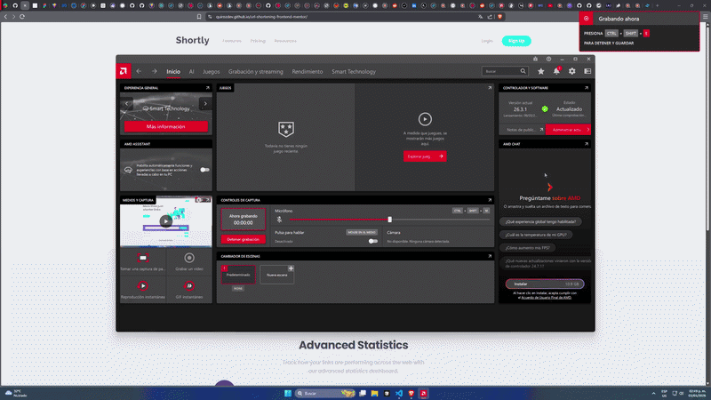

# Frontend Mentor - Shortly URL shortening API Challenge solution

This is a solution to the [Shortly URL shortening API Challenge challenge on Frontend Mentor](https://www.frontendmentor.io/challenges/url-shortening-api-landing-page-2ce3ob-G).

<a href="https://quirozdev.github.io/url-shortening-frontend-mentor/" target="_blank">Live Site Demo</a>

## Table of contents

- [Overview](#overview)
  - [The challenge](#the-challenge)
  - [Links](#links)
- [My process](#my-process)
  - [Built with](#built-with)
- [Author](#author)

## Overview

### The challenge

Users should be able to:

- View the optimal layout for the site depending on their device's screen size
- Shorten any valid URL
- See a list of their shortened links, even after refreshing the browser
- Copy the shortened link to their clipboard in a single click
- Receive an error message when the `form` is submitted if:
  - The `input` field is empty

### Links

- <a href="https://github.com/Quirozdev/url-shortening-frontend-mentor" target="_blank">Solution URL</a>
- <a href="https://quirozdev.github.io/url-shortening-frontend-mentor/" target="_blank">Live Site URL</a>

### Built with

- React and Typescript
- TailwindCSS
- Responsive design
- CSS Grid
- Zustand

## Author

- GitHub - <a href="https://github.com/Quirozdev" target="_blank">Quirozdev</a>
